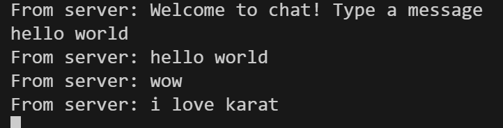
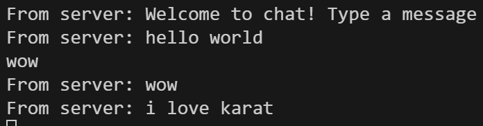
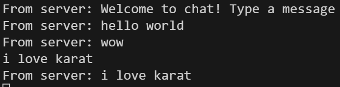
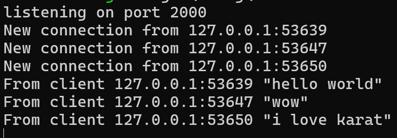

Pengujian menunjukkan bahwa server WebSocket di port 2000 dapat mengelola hingga tiga klien secara simultan dengan koneksi yang stabil. Setiap klien berhasil tersambung tanpa hambatan dan melakukan pertukaran data dengan lancar. Sistem broadcast beroperasi secara real-time, mendistribusikan pesan dari satu klien ke klien lainnya tanpa penundaan berarti. Tidak terdapat blocking selama proses komunikasi berlangsung, memastikan pengalaman chat yang responsif. Keandalan ini dicapai berkat arsitektur asynchronous yang mendasari seluruh sistem. Perpaduan tokio_websockets dengan broadcast channel dari Tokio terbukti sangat efektif untuk kebutuhan aplikasi chat sederhana.

---
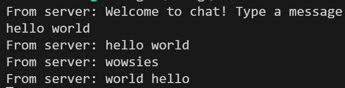
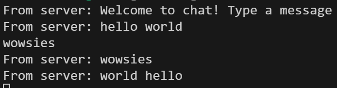
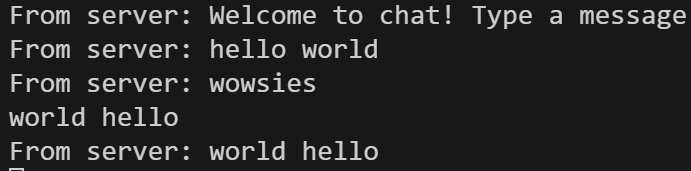
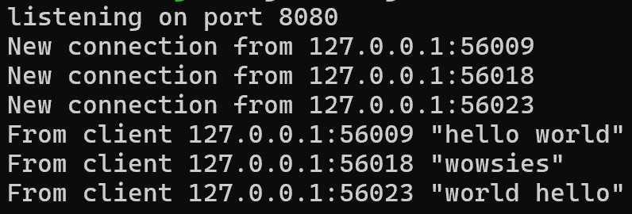

Dalam eksperimen lanjutan, kami mengubah port komunikasi dari 2000 menjadi 8080 pada kedua komponen sistem chat. Pada server, penyesuaian dilakukan melalui parameter `TcpListener::bind`, sedangkan pada klien URI di fungsi `ClientBuilder::from_uri` diperbarui sesuai port baru. Meskipun port diganti, konektivitas tetap terjaga dengan baik dan pertukaran pesan berlangsung lancar tanpa hambatan. Performa real-time sistem juga tetap konsisten seperti pada konfigurasi awal. Temuan ini menegaskan bahwa port berfungsi hanya sebagai endpoint jaringan, sedangkan keberhasilan komunikasi bergantung pada kesesuaian alamat dan protokol. Logika aplikasi tidak terpengaruh karena perubahan hanya terjadi pada lapisan transport, sementara protokol WebSocket tetap menjadi dasar komunikasi. Dengan demikian, aplikasi chat berbasis WebSocket ini terbukti fleksibel dalam konfigurasi jaringan tanpa mengorbankan fungsionalitas. 

---
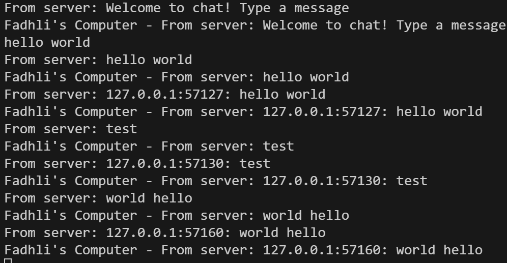
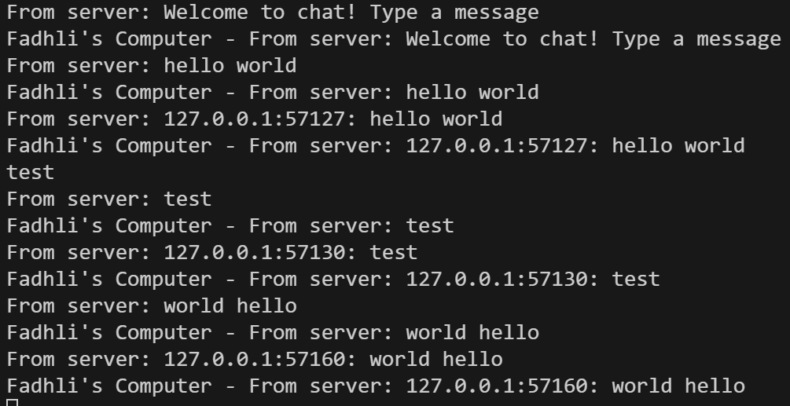
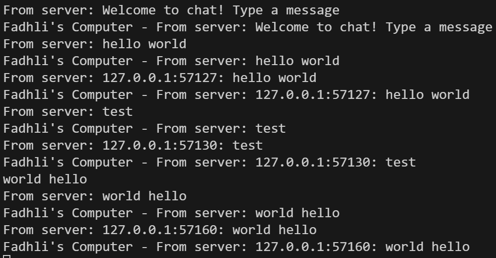
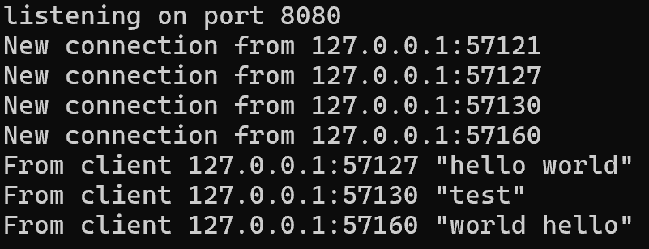

Pengembangan terbaru menambahkan metadata alamat IP dan port pengirim ke setiap pesan, sehingga asal pesan dapat diidentifikasi langsung. Pada sisi server, perubahan dilakukan dengan memodifikasi panggilan `bcast_tx.send(...)` untuk menyertakan informasi `addr`. Kini setiap klien dapat melihat alamat teknis pengirim dalam format `alamat:port`, sebelum sistem username resmi diterapkan. Antarmuka klien juga diperbarui dengan label “Zufar's Computer - From server:” untuk membedakan pesan masuk dari input lokal. Penambahan metadata ini meningkatkan konteks komunikasi, memudahkan debugging, dan membuka jalan bagi implementasi identifikasi pengguna yang lebih kompleks di masa mendatang.